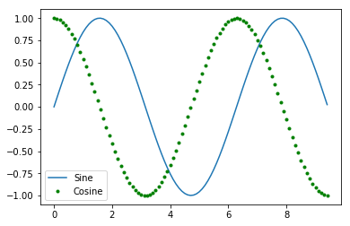
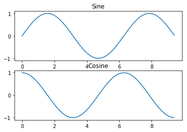

学习一下cs231中关于python的简单介绍，准备转入python语言和深度学习

快速排序的基本思想：选择一个数然后把小于这个数的放左边，大于这个数的放在右边，但是感觉python的这种实现方法比较愚笨，没有c语言直接在地址上面的操作灵活。


```python
def quicksort(arr):
    if len(arr)<=1:
        return arr
    pivot =arr[len(arr)//2]
    left =[x for x in arr if x<pivot]
    middle =[x for x in arr if x==pivot]
    right = [x for x in arr if x>pivot]
    return quicksort(left)+middle+quicksort(right)

print (quicksort([1,5,6,9,4,3,85,27,5,68]))
```

    [1, 3, 4, 5, 5, 6, 9, 27, 68, 85]
    


```python
#python基本的操作运算
x =3
print(type(x))
print (x)
print (x,x+1,x**2,x**3)
```

    <class 'int'>
    3
    3 4 9 27
    


```python
#string 类型的操作，真的非常的方便
str2='%s %d %s' %('hello',34,'zhufei')
print (str2)
print (str2.capitalize())
str3=str2.rjust(17)
print (str3)
print (str3.strip())
```

    hello 34 zhufei
    Hello 34 zhufei
      hello 34 zhufei
    hello 34 zhufei
    

List is python equivalent of an array,but it is more convinient than c


```python
#list 数组内部数据可以是不同类型的
xs = [3, 1, 2]    # Create a list
# xs.add(3) list has no attribute add 
print(xs, xs[1])  # Prints "[3, 1, 2] 2"
print(xs[-1])     # Negative indices count from the end of the list; prints "2"
xs[2] = 'foo'     # Lists can contain elements of different types
print(xs)         # Prints "[3, 1, 'foo']"
xs.append('bar')  # Add a new element to the end of the list
print(xs)         # Prints "[3, 1, 'foo', 'bar']"
x = xs.pop()      # Remove and return the last element of the list
print(x, xs)      # Prints "bar [3, 1, 'foo']"
print(xs[1:2])    #list切片 a<=x<b,因为是从0开始计数的
```

    [3, 1, 2] 1
    2
    [3, 1, 'foo']
    [3, 1, 'foo', 'bar']
    bar [3, 1, 'foo']
    [1]
    


```python
list = [1,23,'hello',1.25]
for element in list:
    print (element)
animals =['ssss','ddd','sadf']
for idx,elment in enumerate(list):
    print ('#%d: %s' %(idx+1,elment))
    print (type(elment))
    

    
    
#list comprehensions:
nums =[1,2,3,4,5,6,7]
s =[x**2 for x in nums if x%3==0]
print (s)
```

    1
    23
    hello
    1.25
    #1: 1
    <class 'int'>
    #2: 23
    <class 'int'>
    #3: hello
    <class 'str'>
    #4: 1.25
    <class 'float'>
    [9, 36]
    

A dictionary stores (key, value) pairs, similar to a Map in Java or an object in Javascript


```python
d = {'cat': 'cute', 'dog': 'furry'}  # Create a new dictionary with some data
print(d['cat'])       # Get an entry from a dictionary; prints "cute"
print('cat' in d)     # Check if a dictionary has a given key; prints "True"
d['fish'] = 'wet'     # Set an entry in a dictionary
print(d['fish'])      # Prints "wet"
# print(d['monkey'])  # KeyError: 'monkey' not a key of d
print(d.get('monkey', 'N/A'))  # Get an element with a default; prints "N/A"
print(d.get('fish', 'N/A'))    # Get an element with a default; prints "wet"
del d['fish']         # Remove an element from a dictionary
print(d.get('fish', 'N/A')) # "fish" is no longer a key; prints "N/A"

d = {'person': 2, 'cat': 4, 'spider': 8}
for animal, legs in d.items():
    print('A %s has %d legs' % (animal, legs))
```

    cute
    True
    wet
    N/A
    wet
    N/A
    A person has 2 legs
    A cat has 4 legs
    A spider has 8 legs
    


```python
A set is an unordered collection of distinct elements. As a simple example, consider the following
集合是元素的无序集，里面的顺序是随机的
```


```python
animals = {'cat', 'dog'}
print('cat' in animals)   # Check if an element is in a set; prints "True"
print('fish' in animals)  # prints "False"
animals.add('fish')       # Add an element to a set
print('fish' in animals)  # Prints "True"
print(len(animals))       # Number of elements in a set; prints "3"
animals.add('cat')        # Adding an element that is already in the set does nothing cat is in the set already
print(len(animals))       # Prints "3"
animals.remove('cat')     # Remove an element from a set
print(len(animals))       # Prints "2"
```

    True
    False
    True
    3
    3
    2
    


```python
#并不是完全随机，好像是一个伪随机的过程
animals = { 'dog', 'fish','fly','flower','cat'}
for idx, animal in enumerate(animals):
    print('#%d: %s' % (idx + 1, animal))
```

    #1: cat
    #2: dog
    #3: fish
    #4: flower
    #5: fly
    

A tuple is an (immutable) ordered list of values. A tuple is in many ways similar to a list; one of the most important differences is that tuples can be used as keys in dictionaries and as elements of sets, while lists cannot. Here is a trivial example
tuple 是不可变的list，tuple可以作为字典的键值和集合的元素


```python
d = {(x, x + 1): x for x in range(10)}  # Create a dictionary with tuple keys
t = (5, 6)        # Create a tuple
print(type(t))    # Prints "<class 'tuple'>"
print(d[t])       # Prints "5"
print(d[(1, 2)])  # Prints "1"
```

    <class 'tuple'>
    5
    1
    

classes python也可以像c++一眼定义类别


```python
class Greeter(object):
    def __init__(self,name):
        self.name = name
    # Instance method
    def greet(self, loud=False):
        if loud:
            print('HELLO, %s!' % self.name.upper())
        else:
            print('Hello, %s' % self.name)

g = Greeter('Fred')  # Construct an instance of the Greeter class
g.greet()            # Call an instance method; prints "Hello, Fred"
g.greet(loud=True)   # Call an instance method; prints "HELLO, FRED!"
```

    Hello, Fred
    HELLO, FRED!
    


```python
import numpy as np

#numpy 是相同数据类型的数,矩阵的初始化如下所示
#我认为矩阵的定义还是比不上matlab灵活，因为必须要使用list这个东西的原因吧
a = np.array([[-1,2.5,3],[4,5,6]])
print (type(a[1,1]))
print (a.shape)

#和matlab一样，也提供了很多的初始化函数
print (np.random.random((2,2)))#第一个是包，第二个是函数

#Numpy offers several ways to index into arrays.
a = np.array([[1,2,3,4], [5,6,7,8], [9,10,11,12]])
b = a[0:1, 1:4]#这个切片和matlab不一样。。。。
print (a)
print (b)

row_r1 = a[1, :]    # Rank 1 view of the second row of a
row_r2 = a[1:2, :]  # Rank 2 view of the second row of a
print(row_r1, row_r1.shape)  # Prints "[5 6 7 8] (4,)"
print(row_r2, row_r2.shape)  # Prints "[[5 6 7 8]] (1, 4)"

# We can make the same distinction when accessing columns of an array:
col_r1 = a[:, 1]
col_r2 = a[:, 1:2]
print(col_r1, col_r1.shape)  # Prints "[ 2  6 10] (3,)"
print(col_r2, col_r2.shape)  # Prints "[[ 2]
                             #          [ 6]
                             #          [10]] (3, 1)"
```

    <class 'numpy.float64'>
    (2, 3)
    [[ 0.52511075  0.47093033]
     [ 0.99184283  0.50332739]]
    [[ 1  2  3  4]
     [ 5  6  7  8]
     [ 9 10 11 12]]
    [[2 3 4]]
    [5 6 7 8] (4,)
    [[5 6 7 8]] (1, 4)
    [ 2  6 10] (3,)
    [[ 2]
     [ 6]
     [10]] (3, 1)
    


```python
import numpy as np

a = np.array([[1,2], [3, 4], [5, 6]])

# An example of integer array indexing.
# The returned array will have shape (3,) and
print(a[[0, 1, 2], [0, 1, 0]])  # Prints "[1 4 5]"

# The above example of integer array indexing is equivalent to this:
print(np.array([a[0, 0], a[1, 1], a[2, 0]]))  # Prints "[1 4 5]"

# When using integer array indexing, you can reuse the same
# element from the source array:
print(a[[0, 0], [1, 1]])  # Prints "[2 2]"

# Equivalent to the previous integer array indexing example
print(np.array([a[0, 1], a[0, 1]]))  # Prints "[2 2]"
```

    [1 4 5]
    [1 4 5]
    [2 2]
    [2 2]
    


```python
import numpy as np

# Create a new array from which we will select elements
a = np.array([[1,2,3], [4,5,6], [7,8,9], [10, 11, 12]])

print(a)  # prints "array([[ 1,  2,  3],
          #                [ 4,  5,  6],
          #                [ 7,  8,  9],
          #                [10, 11, 12]])"

# Create an array of indices
b = np.array([0, 2, 0, 1])

# Select one element from each row of a using the indices in b
print(a[np.arange(4), b])  # Prints "[ 1  6  7 11]"

# Mutate one element from each row of a using the indices in b
a[np.arange(4), b] += 10

print(a)  # prints "array([[11,  2,  3],
          #                [ 4,  5, 16],
          #                [17,  8,  9],
          #                [10, 21, 12]])
```

    [[ 1  2  3]
     [ 4  5  6]
     [ 7  8  9]
     [10 11 12]]
    [ 1  6  7 11]
    [[11  2  3]
     [ 4  5 16]
     [17  8  9]
     [10 21 12]]
    

Boolean array indexing: Boolean array indexing lets you pick out arbitrary elements of an array. Frequently this type of indexing is used to select the elements of an array that satisfy some condition. Here is an example:
- 布尔值矩阵索引


```python
import numpy as np

a = np.array([[1,2], [3, 4], [5, 6]])

bool_idx = (a > 2)   # Find the elements of a that are bigger than 2;
                     # this returns a numpy array of Booleans of the same
                     # shape as a, where each slot of bool_idx tells
                     # whether that element of a is > 2.

print(bool_idx)      # Prints "[[False False]
                     #          [ True  True]
                     #          [ True  True]]"

# We use boolean array indexing to construct a rank 1 array
# consisting of the elements of a corresponding to the True values
# of bool_idx
print(a[bool_idx])  # Prints "[3 4 5 6]"

# We can do all of the above in a single concise statement:
print(a[a > 2])     # Prints "[3 4 5 6]"
```

    [[False False]
     [ True  True]
     [ True  True]]
    [3 4 5 6]
    [3 4 5 6]
    

矩阵的数学运算


```python
import numpy as np

#定义矩阵的时候定义了数据类型
x = np.array([[1,2],[3,4]], dtype=np.float64)
y = np.array([[5,6],[7,8]], dtype=np.float64)

# Elementwise sum; both produce the array
# [[ 6.0  8.0]
#  [10.0 12.0]]
print(x + y)
print(np.add(x, y))
print(np.multiply(x, y))#使用*
print(np.divide(x, y))

#矩阵乘法
print(x.dot(y))
print(np.dot(x, y))

#其他函数
print(np.sum(x,axis=0))
print (x.T)
# Note that taking the transpose of a rank 1 array does nothing:
v = np.array([1,2,3])
print(v)    # Prints "[1 2 3]"
print(v.T)  # Prints "[1 2 3]"
```

    [[  6.   8.]
     [ 10.  12.]]
    [[  6.   8.]
     [ 10.  12.]]
    [[  5.  12.]
     [ 21.  32.]]
    [[ 0.2         0.33333333]
     [ 0.42857143  0.5       ]]
    [[ 19.  22.]
     [ 43.  50.]]
    [[ 19.  22.]
     [ 43.  50.]]
    [ 4.  6.]
    [[ 1.  3.]
     [ 2.  4.]]
    [1 2 3]
    [1 2 3]
    

Broadcasting is a powerful mechanism that allows numpy to work with arrays of different shapes when performing arithmetic operations. Frequently we have a smaller array and a larger array, and we want to use the smaller array multiple times to perform some operation on the larger array.
广播，类似于matlab里面的repmat函数


```python
import numpy as np

# We will add the vector v to each row of the matrix x,
# storing the result in the matrix y
x = np.array([[1,2,3], [4,5,6], [7,8,9], [10, 11, 12]])
v = np.array([1, 0, 1])
np.tile
vv = np.tile(v, (4, 1))   # Stack 4 copies of v on top of each other
print(vv)                 # Prints "[[1 0 1]
                          #          [1 0 1]
                          #          [1 0 1]
                          #          [1 0 1]]"
y = x + vv  # Add x and vv elementwise
print(y)  # Prints "[[ 2  2  4
          #          [ 5  5  7]
          #          [ 8  8 10]
          #          [11 11 13]]"
            
            
#but numpy can do it directly     
z = x + v  # Add v to each row of x using broadcasting
print(z)


#here are some application of broadcasting 
v = np.array([1,2,3])  # v has shape (3,)
w = np.array([4,5])    # w has shape (2,)

print(np.reshape(v, (3, 1)) * w)

# Add a vector to each row of a matrix
x = np.array([[1,2,3], [4,5,6]])
# x has shape (2, 3) and v has shape (3,) so they broadcast to (2, 3),
# giving the following matrix:
# [[2 4 6]
#  [5 7 9]]
print(x + v)

print((x.T + w).T)
# Another solution is to reshape w to be a column vector of shape (2, 1);
# we can then broadcast it directly against x to produce the same
# output.
print(x + np.reshape(w, (2, 1)))

```

    [[1 0 1]
     [1 0 1]
     [1 0 1]
     [1 0 1]]
    [[ 2  2  4]
     [ 5  5  7]
     [ 8  8 10]
     [11 11 13]]
    [[ 2  2  4]
     [ 5  5  7]
     [ 8  8 10]
     [11 11 13]]
    [[ 4  5]
     [ 8 10]
     [12 15]]
    [[2 4 6]
     [5 7 9]]
    [[ 5  6  7]
     [ 9 10 11]]
    [[ 5  6  7]
     [ 9 10 11]]
    

Matplotlib is a plotting library. In this section give a brief introduction to the matplotlib.pyplot module, which provides a plotting system similar to that of MATLAB
提供类似于matlab的画图功能


```python
import numpy as np
import matplotlib.pyplot as plt

# Compute the x and y coordinates for points on a sine curve
x = np.arange(0, 3 * np.pi, 0.1)
y = np.sin(x)
z = np.cos(x)

# Plot the points using matplotlib
plt.plot(x, y)
plt.plot(x, z,'g.')
plt.legend(['Sine', 'Cosine'])
plt.show()  # You must call plt.show() to make graphics appear.

plt.subplot(2, 1, 1)

# Make the first plot
plt.plot(x, y)
plt.title('Sine')

# Set the second subplot as active, and make the second plot.
plt.subplot(2, 1, 2)
plt.plot(x, z)
plt.title('Cosine')

# Show the figure.
plt.show()
```







